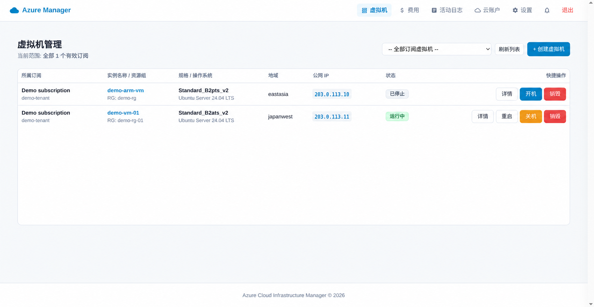

# Azure Manager

Azure Manager 是一个自托管的 Microsoft Azure 多订阅运维管理面板，使用 Python 3.11、Flask、SQLite 和 Azure 官方管理 SDK 构建，适合个人管理员或小型团队集中管理 Azure 虚拟机及相关资源。

> 本项目面向需要轻量 Azure 管理面板的使用者。正式环境部署前，请自行审查源代码、Azure 权限和网络安全配置。



## 功能概览

- **账户与订阅管理**：管理多个 Azure Service Principal，自动发现并同步订阅，并按订阅筛选面板数据。
- **虚拟机全生命周期管理**：动态读取 Azure 地域、规格和市场镜像；识别 x64 与 ARM64 架构；支持创建、开机、关机释放、重启、销毁、换盘重装、调整规格、更换公网 IP 和重置管理员凭据。
- **网络安全组管理**：查看和管理 NSG 入站规则，配置协议、源 CIDR、目标端口范围、优先级和访问动作。
- **监控与费用**：查看 Azure Monitor CPU、内存、网络和磁盘指标；通过 Azure Cost Management 和 Consumption API 查询月度累计费用。
- **动态探测、缓存与任务**：将 Azure 动态探测结果缓存到 SQLite，使用持久化任务表记录 Pending、InProgress、Succeeded 和 Failed 状态。
- **活动通知**：通过顶部即时提示、活动通知抽屉和“活动日志”页面展示操作状态与历史任务。
- **安全控制**：要求外部注入唯一 SECRET_KEY，加密 Azure 客户端密码和脚本内容，校验 CSRF、限制数据库上传并验证 SQLite 备份。

## 系统架构

应用由 Flask Web 层、Azure 服务层、SQLAlchemy 数据模型和后台任务线程组成：

```text
浏览器
  -> HTTPS 反向代理（推荐）
  -> 127.0.0.1:8888
  -> Gunicorn
  -> Flask 路由与后台任务
  -> Azure 管理 API
  -> /app/data/database.db
```

默认 Docker 启动命令使用 1 个 Gunicorn Worker、2 个线程，适配 2C1G 主机并避免 SQLite 多进程写入竞争。SQLite 使用 WAL 模式，因此应用运行时必须将数据库文件及其 WAL 伴随文件保存在持久化存储中。

## 环境要求

- Docker Engine 20 或更高版本
- Azure 租户和至少一个订阅
- 具有目标资源管理权限的 Azure App Registration 或 Service Principal
- 稳定且随机生成的 SECRET_KEY

项目 Dockerfile 使用 Python 3.11，并从 requirements.lock 安装已锁定版本的 Azure 管理 SDK。锁文件来源、Python 版本和镜像摘要写在文件头；修改 requirements.txt 后必须在受控 Python 3.11 环境重新生成并审查。

## 全新部署

以下步骤均在实际运行 Docker 的部署服务器上执行。示例将项目部署到 `/opt/azure-manager`：

```bash
sudo mkdir -p /opt/azure-manager/data
sudo chown -R 10001:10001 /opt/azure-manager/data
cd /opt/azure-manager
docker build -t azure-manager .
```

生成一次强随机密钥，并在该数据库目录的整个生命周期内保持不变：

```bash
openssl rand -hex 32
```

正式部署时只将面板端口绑定到服务器本机，交由 Caddy 或 Nginx 对外提供 HTTPS：

```bash
docker run -d \
  --name azure-manager \
  -p 127.0.0.1:8888:8888 \
  -v /opt/azure-manager/data:/app/data \
  -e SECRET_KEY="替换为上一步生成的随机密钥" \
  --restart unless-stopped \
  azure-manager
```

面板后端地址为 `http://127.0.0.1:8888`。不要将 8888 端口直接暴露到公网。当前项目默认 `SESSION_COOKIE_SECURE=1`，通过 HTTPS 反代访问时无需额外设置。

### Caddy 反向代理

Caddy 运行在 Docker daemon 所在的宿主机上时，最简配置如下。将域名替换为自己的域名：

```caddyfile
panel.example.com {
    reverse_proxy 127.0.0.1:8888
}
```

域名的 DNS 记录应指向服务器公网 IP，并确保公网可访问 80 和 443 端口。Caddy 会自动申请、续期 HTTPS 证书并将 HTTP 重定向到 HTTPS。Caddyfile 配置完成后，可使用以下命令检查并加载：

```bash
sudo caddy validate --config /etc/caddy/Caddyfile
sudo systemctl reload caddy
```

Caddy 反代无需额外环境变量即可工作。以下参数均为可选项：

| 变量 | 默认值 | 用途 |
| --- | --- | --- |
| `SESSION_COOKIE_SECURE` | `1` | 只允许登录 Cookie 通过 HTTPS 发送 |
| `TRUST_PROXY_HOPS` | `0` | 指定应用前面有几层可信反向代理 |
| `ENABLE_HSTS` | 未开启 | 让应用返回 HSTS 响应头 |

单层 Caddy 反代无需配置上述可选参数。若需要让登录限流和日志记录真实客户端 IP，可增加：

```bash
-e TRUST_PROXY_HOPS=1
```

确认站点及其子域均已启用 HTTPS 后，可增加：

```bash
-e ENABLE_HSTS=1
```

启用 `TRUST_PROXY_HOPS=1` 前，必须确保 8888 端口只绑定到本机：

```bash
-p 127.0.0.1:8888:8888
```

否则客户端可能绕过 Caddy 直接访问应用并伪造转发请求头。存在多层可信代理时，`TRUST_PROXY_HOPS` 应按实际层数设置为 1 到 3；协议和来源转发层数不一致时，再分别设置 `TRUST_PROXY_FOR_HOPS` 与 `TRUST_PROXY_PROTO_HOPS`。

应用会为所有响应添加基础安全响应头。TLS 应由 Nginx、Caddy 等反向代理终止，并将原始协议正确传递给应用。

### 部署注意事项

- 必须挂载 /app/data，默认数据库路径为 /app/data/database.db。
- 容器以固定的非 root 用户 UID/GID 10001 运行；宿主机挂载目录必须允许该用户读写，首次部署可执行 `sudo chown -R 10001:10001 data`。
- 保存 Azure 凭据或脚本后不要更换 SECRET_KEY。同一个密钥同时用于 Flask 会话和数据库字段加密。
- 容器运行期间不要手动删除 database.db-wal 或 database.db-shm。
- 手动复制 SQLite 数据库前，应先正常停止应用。

### 可选数据库路径

可以通过 DATABASE_PATH 指定挂载目录中的其他 SQLite 文件：

```bash
-e DATABASE_PATH=/app/data/database.db
```

## 首次登录

全新数据库首次提交登录表单时，会自动创建第一个管理员账号。登录后：

1. 进入“云账户”。
2. 添加 Azure Service Principal。
3. 等待面板发现并同步订阅。
4. 选择订阅后进入虚拟机或费用页面。

建议为本面板创建专用 Service Principal。不要将客户端密码写入仓库、README、Issue 或截图。

## Azure 凭据与权限

可以使用 Azure CLI 或 Azure Cloud Shell 创建 Service Principal。实际角色应根据需要管理的资源确定。订阅范围的 Contributor 最容易配置，但生产环境建议进一步使用最小权限自定义角色。

示例：

```bash
subscription_id=$(az account show --query id -o tsv)
az ad sp create-for-rbac --name azure-manager-sp --role Contributor --scopes /subscriptions/$subscription_id
```

将命令返回的应用 ID、客户端密码和租户 ID 填入“云账户”页面。资源最终状态仍以 Azure 为准。

## 动态数据和缓存

创建页、重装页和 VM 详情页不依赖固定的地域、规格或镜像列表：

- 地域按订阅从 Azure 动态读取，缓存有效期最长 24 小时。
- 创建页使用的虚拟机通用规格从 Azure 动态读取，缓存有效期最长 24 小时。
- 市场镜像按订阅、地域和架构缓存，区分 x64 与 arm64，缓存有效期最长 24 小时。过期镜像可先返回，同时后台刷新。
- VM 列表缓存有效期为 15 分钟。强制刷新会创建后台同步任务，并在 Azure 返回后更新缓存。
- 创建和重装会使用缓存中真实的镜像 URN，并在提交前再次进行架构校验。
- VM 详情页支持调整规格，可选目标来自 Azure 通过 `list_available_sizes` 返回的该 VM 专属可调整列表，而不是所在地域的通用规格列表。
- 调整规格可能导致停机；临时磁盘中的数据将丢失，动态公网 IP 地址可能发生变化。操作成功后，原状态为 Running 的 VM 会自动启动，原状态为 Deallocated 的 VM 会保持关机释放状态。

### 虚拟机升降配

在 VM 详情页点击“调整规格”即可查看当前虚拟机可用的目标规格。列表由 Azure 的 `list_available_sizes` 接口按资源组和虚拟机实时获取，展示 vCPU、内存、临时磁盘和最大数据盘数量；界面中的短缓存最长保留 60 秒，提交前会再次向 Azure 实时校验目标规格。

升降配目前仅支持独立 VM 的 `Running` 和 `Deallocated` 状态：

- `Running`：解除分配 VM -> 更新规格 -> 启动 VM，成功后恢复运行。
- `Deallocated`：解除分配状态下直接更新规格，完成后保持 `Deallocated`。
- Availability Set、VMSS 和 Dedicated Host 中的 VM 暂不支持自动升降配。

升降配作为后台任务执行，进度和结果可在页面任务提示及“活动日志”中查看。同一台 VM 已有其他操作时会复用原任务，避免重复调用 Azure。Azure 操作失败时，任务会标记为失败并尽力回读实际规格和电源状态，不会用未确认的目标状态覆盖本地缓存。

调整规格前请确认能够接受停机、临时磁盘数据丢失和动态公网 IP 变化风险，并确认目标规格在该区域和订阅中仍有容量及配额。

## 活动通知和活动日志

长时间运行的操作会先创建持久化任务，再调用 Azure。界面提供顶部即时提示、活动通知抽屉和“活动日志”页面。

“清空活动日志”只会删除允许删除的任务记录，不会删除数据库文件，也不会删除 Azure 账户和缓存数据。关闭通知也不会删除历史活动日志。

## 备份与恢复

使用“设置 -> 数据库备份”下载 SQLite 备份。恢复前，应用会检查文件格式、大小、SQLite 完整性和基础数据表。请将备份文件与对应的 SECRET_KEY 一起保存；包含加密字段的数据库无法使用其他密钥解密。

手动备份容器数据时，建议先停止容器：

```bash
docker stop azure-manager
cp -a data data.backup
docker start azure-manager
```

## 项目结构

```text
azure-manager/
├── azure/
│   ├── app.py              Flask 路由、任务编排和 API
│   ├── azure_service.py    Azure SDK 操作和动态探测
│   ├── models.py           SQLAlchemy 模型和加密字段
│   ├── templates/          Jinja 模板
│   └── static/              CSS 和前端 JavaScript
├── data/                   持久化 SQLite 数据（Git 忽略）
├── screenshots/            脱敏后的文档截图
├── Dockerfile
├── requirements.txt
├── requirements.lock
└── README.md
```

## 许可证与致谢

本仓库基于 [1injex/azure-manager](https://github.com/1injex/azure-manager) 二次开发。重新分发时请遵守上游项目许可证并保留适用的版权和许可声明。
